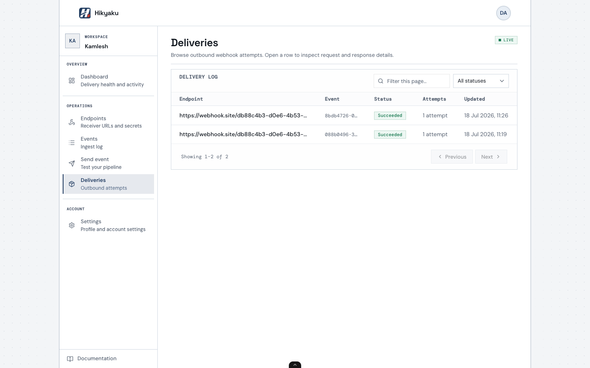
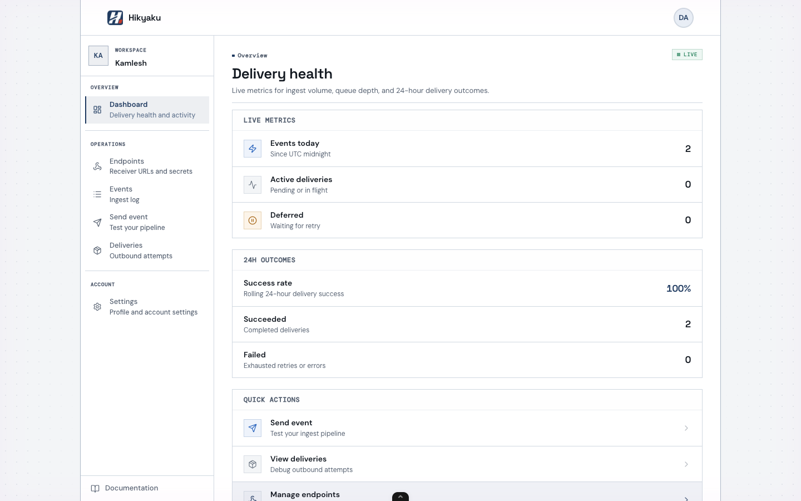

# Hikyaku

<p align="center">
  
</p>

Self-hosted, multi-tenant webhook delivery. Ingest an event once; the worker fans it out as HMAC-SHA256-signed HTTP POSTs, retries transient failures with exponential backoff, and keeps attempt history in an operator console.

**Name:** 飛脚 (*hikyaku*) — Japan’s historic express couriers.

**Stack:** Node.js, Express, BullMQ, Postgres, Redis, Vite/React.

**Repo:** [github.com/0x4Nayan04/Hikyaku](https://github.com/0x4Nayan04/Hikyaku) · **License:** [MIT](./LICENSE)

**Docs (after `pnpm dev`):** http://localhost:5173/docs · [Console guide](http://localhost:5173/docs/console-guide)

## Demo

No hosted demo yet — run it locally (below). After `pnpm dev`:

| Surface | URL |
| ------- | --- |
| Landing | http://localhost:5173 |
| Docs | http://localhost:5173/docs |
| Console | http://localhost:5173/login |

Bootstrap once at `/bootstrap`, approve a signup on **Admin**, then use the tenant console.

## Architecture

```
Producer ──POST /v1/events──► API ──enqueue──► Redis (BullMQ)
                                                │
                                                ▼
                                         Worker (fan-out)
                                                │
                         ┌──────────────────────┼──────────────────────┐
                         ▼                      ▼                      ▼
                   Endpoint A             Endpoint B             Endpoint C
                (HMAC-SHA256 POST)     (retry / backoff)      (attempt logs)
                                                │
                                                ▼
                                         Postgres + console
                                    (events, deliveries, SSE)
```

| Piece | Role |
| ----- | ---- |
| `apps/api` | Auth, ingest, endpoints, deliveries, admin |
| `apps/worker` | Signed outbound HTTP, retries, rate limits |
| `apps/web` | Landing, docs, operator console |
| Postgres | Tenants, events, deliveries, attempt history |
| Redis | BullMQ delivery queue |

## Screenshots





## Prerequisites

- Node.js 20 (`nvm use`)
- [pnpm](https://pnpm.io/)
- Docker (Postgres 16 + Redis 7 for local development)

## Local development

```bash
git clone https://github.com/0x4Nayan04/Hikyaku.git
cd Hikyaku
cp .env.example .env
pnpm install
pnpm docker:up
pnpm db:migrate
pnpm dev
```

This starts:

| Service       | URL                                  |
| ------------- | ------------------------------------ |
| API           | http://localhost:3000                |
| Web console   | http://localhost:5173                |
| Docs          | http://localhost:5173/docs           |
| Worker        | background process (BullMQ consumer) |

Run services individually:

```bash
pnpm --filter @webhook/api dev
pnpm --filter @webhook/worker dev
pnpm --filter @webhook/web dev
```

## First-time setup

### Option A — Bootstrap (local UI)

1. Open http://localhost:5173/bootstrap
2. Enter `ADMIN_BOOTSTRAP_SECRET` from `.env`
3. Create the super-admin → sign in at `/login`
4. On **Admin**, approve a signup from `/signup` or invite a tenant owner
5. Sign in as that tenant → **Dashboard** (`/dashboard`)

### Option B — Dev seed (API smoke tests)

```bash
pnpm db:seed
# Copy one of the printed API keys (whk_...)
```

Optional super-admin seed (only when no users exist):

```bash
# In .env:
# SEED_SUPER_ADMIN_EMAIL=admin@localhost
# SEED_SUPER_ADMIN_PASSWORD=dev-password-min-12-chars
```

## Console overview

| Page            | Route                | Who                      |
| --------------- | -------------------- | ------------------------ |
| Landing         | `/`                  | Public                   |
| Docs            | `/docs`              | Public                   |
| Login / Signup  | `/login`, `/signup`  | Public                   |
| Bootstrap       | `/bootstrap`         | First deploy only        |
| Accept invite   | `/accept-invite`     | Invite recipients        |
| Dashboard       | `/dashboard`         | Tenant users             |
| Endpoints       | `/endpoints`         | Tenant users             |
| Events          | `/events`            | Tenant users             |
| Send event      | `/events/send`       | Tenant users             |
| Deliveries      | `/deliveries`        | Tenant users (SSE/poll)  |
| Settings        | `/settings`          | Tenant users             |
| Admin           | `/admin`             | Super-admin only         |
| Tenant admin    | `/admin/tenants/:id` | Super-admin only         |

**Roles:** Super-admins manage tenants (approve signups, invite owners, audit log). Tenant users manage endpoints, events, deliveries, and API keys. Super-admins are not tenant-scoped and cannot open tenant dashboard pages.

## Health checks

```bash
curl http://localhost:3000/v1/health
curl http://localhost:3000/v1/ready
```

`/v1/health` — API process up. `/v1/ready` — Postgres and Redis reachable.

## Authentication

| Mode               | Use case                           | How                                   |
| ------------------ | ---------------------------------- | ------------------------------------- |
| **API key**        | Scripts, backends, `curl`          | `Authorization: Bearer whk_...`       |
| **Session cookie** | Browser console                    | Login at `/login` → httpOnly session  |

API keys: **Settings → API keys** or `POST /v1/api-keys`. Shown once on create/rotate; only a SHA-256 hash is stored.

## Events API

Ingest with a tenant API key or session cookie. Returns `202 Accepted`.

```bash
curl -X POST http://localhost:3000/v1/events \
  -H "Authorization: Bearer whk_..." \
  -H "Content-Type: application/json" \
  -d '{"idempotency_key":"order-123","type":"order.created","payload":{"order_id":"ord_123"}}'
```

| Field             | Rules                       |
| ----------------- | --------------------------- |
| `idempotency_key` | Required, unique per tenant |
| `type`            | Required event type string  |
| `payload`         | Required JSON object        |

Duplicate `idempotency_key` returns the existing event with `202` — no duplicate fan-out.

List/inspect: `GET /v1/events`, `GET /v1/events/:id`.

## Endpoints API

Endpoints are scoped to the tenant from your API key or session.

### Create

Returns `201` with the signing secret **once**. Store `secret` immediately — list/update never include it.

```bash
curl -X POST http://localhost:3000/v1/endpoints \
  -H "Authorization: Bearer whk_..." \
  -H "Content-Type: application/json" \
  -d '{"url":"https://webhook.site/test","description":"test"}'
```

| Field         | Rules                                    |
| ------------- | ---------------------------------------- |
| `url`         | Required, valid URL, max 2048 characters |
| `description` | Optional, max 512 characters             |

### List

Paginated: `?limit=` (1–100, default 50), `?offset=` (default 0). No `secret` in responses.

### Disable

Only `status` and `description` can change. `url` and `secret` are immutable (`400 immutable_field`).

```bash
curl -X PATCH "http://localhost:3000/v1/endpoints/<id>" \
  -H "Authorization: Bearer whk_..." \
  -H "Content-Type: application/json" \
  -d '{"status":"disabled"}'
```

Cross-tenant access by endpoint id returns `404 not_found`.

## Deliveries API

| Route                            | Purpose                                    |
| -------------------------------- | ------------------------------------------ |
| `GET /v1/deliveries`             | Paginated list (`?status=` filter)         |
| `GET /v1/deliveries/:id`         | Detail + attempt timeline                  |
| `POST /v1/deliveries/:id/replay` | Re-queue a **failed** delivery (`202`)     |
| `GET /v1/deliveries/stream`      | SSE updates (session cookie only)          |

Outbound body: `{ id, type, created_at, data }` (`data` = ingested payload).

Headers: `Content-Type`, `X-Webhook-Id`, `X-Webhook-Timestamp`, `X-Webhook-Signature` (`sha256=<hex>`), `User-Agent: Hikyaku/1.0`.

## API keys

| Route                          | Purpose                     |
| ------------------------------ | --------------------------- |
| `GET /v1/api-keys`             | List keys (prefix only)     |
| `POST /v1/api-keys`            | Create key (shown once)     |
| `POST /v1/api-keys/:id/revoke` | Revoke                      |
| `POST /v1/api-keys/:id/rotate` | Rotate (new key shown once) |

## Retries and rate limits

| Setting      | Value                                              |
| ------------ | -------------------------------------------------- |
| Max attempts | 5 per delivery                                     |
| Backoff      | Exponential + jitter (~1m → 2m → 4m → 8m, cap 1h) |
| Success      | HTTP 2xx within 30s                                |
| Retryable    | Network error, timeout, 408, 429, 5xx              |
| Fail-fast    | 4xx (except 408, 429)                              |
| Rate limit   | 100 HTTP delivery attempts / minute / tenant       |

Rate-limited jobs defer for 60s without counting toward the 5-attempt cap. Limits come from deployment config (see `.env.example`).

## Manual smoke test (webhook.site)

Needs API, worker, and a tenant API key (`pnpm db:seed` or Settings).

1. Open [webhook.site](https://webhook.site) and copy the URL.
2. Create an endpoint with that URL. Save the `secret`.
3. Ingest an event:

```bash
curl -X POST http://localhost:3000/v1/events \
  -H "Authorization: Bearer whk_..." \
  -H "Content-Type: application/json" \
  -d '{"idempotency_key":"smoke-1","type":"order.created","payload":{"order_id":"ord_123"}}'
```

4. On webhook.site, confirm body `{ id, type, created_at, data }` and signature headers.
5. Verify HMAC-SHA256 over `` `${timestamp}.${rawBody}` ``:

```bash
node --input-type=module -e "
import { verifyPayload } from '@webhook/shared/crypto';
const secret = 'whsec_...';
const timestamp = 1717654321;
const rawBody = '{\"id\":\"...\",\"type\":\"order.created\",\"created_at\":\"...\",\"data\":{\"order_id\":\"ord_123\"}}';
const signature = 'sha256=...';
console.log(verifyPayload(secret, timestamp, rawBody, signature));
"
```

Expected: `true`.

## Environment variables

| Variable                 | Purpose                                   |
| ------------------------ | ----------------------------------------- |
| `DATABASE_URL`           | Postgres                                  |
| `REDIS_URL`              | Redis / BullMQ                            |
| `ADMIN_BOOTSTRAP_SECRET` | One-time super-admin bootstrap            |
| `SESSION_SECRET`         | Session cookie signing (min 32 chars)     |
| `WEB_APP_URL`            | Invite link base URL                      |
| `CORS_ORIGIN`            | Allowed browser origins                   |
| `VITE_API_URL`           | API base URL for the web app (build-time) |

See `.env.example` for worker tuning (`DELIVERY_TIMEOUT_MS`, `MAX_DELIVERY_ATTEMPTS`, `RATE_LIMIT_PER_MINUTE`, etc.).

## Scripts

| Command                 | Description                             |
| ----------------------- | --------------------------------------- |
| `pnpm dev`              | Start API, worker, and web concurrently |
| `pnpm build`            | Build all packages                      |
| `pnpm typecheck`        | TypeScript project references build     |
| `pnpm lint`             | ESLint                                  |
| `pnpm format`           | Prettier                                |
| `pnpm test`             | Unit + integration tests                |
| `pnpm test:integration` | API and worker integration tests        |
| `pnpm test:smoke`       | Playwright smoke / visual tests         |
| `pnpm docker:up`        | Start Postgres and Redis                |
| `pnpm docker:down`      | Stop Docker services                    |
| `pnpm db:migrate`       | Apply database migrations               |
| `pnpm db:seed`          | Seed demo tenants + API keys            |
| `pnpm db:generate`      | Generate Drizzle migrations             |

## Project layout

```
apps/api         REST API (Express) — auth, ingest, deliveries, admin
apps/worker      Delivery worker (BullMQ)
apps/web         Operator console + docs (Vite + React)
packages/shared  Shared types, schema, env parsing, crypto
e2e/             Playwright smoke and visual tests
```
